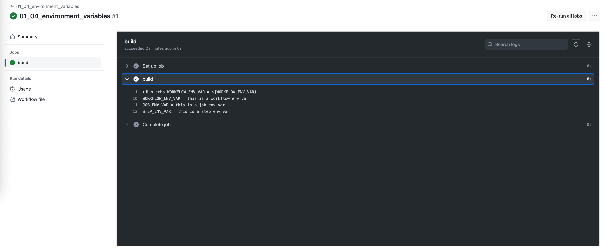

Environment Variable
==============================================================================
环境变量是常见的配置方式. GitHub Actions 支持三个级别的环境变量:

1. Workflow 级别的环境变量, 所有的 Job 里都可以用. 可以在 YAML 文件中设置, 也可以在 settings 中设置.
2. Job 级别的环境变量, 所有的下面的 Step 里都可以用. 只能在 YAML 文件中设置.
3. Step 级别的环境变量, 只能在当前 Step 里用. 只能在 YAML 文件中设置.

环境变量常用语将 Job 参数化. 例如你有个 Job 叫 "deploy", 你可以用环境变量 ``ENV_NAME`` 来指定要部署到哪个环境中.

这里提一句, 对 Workflow 参数化的关键技术是 ``on.workflow_call.inputs``, 这个我们之后会在 :ref:`reuse-workflow` 一节中详细说.

Sample Workflow Definition
------------------------------------------------------------------------------
.. literalinclude:: ../../../../.github/workflows/01_04_environment_variables.yml
   :language: yaml
   :linenos:

Sample Workflow Run
------------------------------------------------------------------------------

Reference
------------------------------------------------------------------------------
- Variables: https://docs.github.com/en/actions/learn-github-actions/variables
