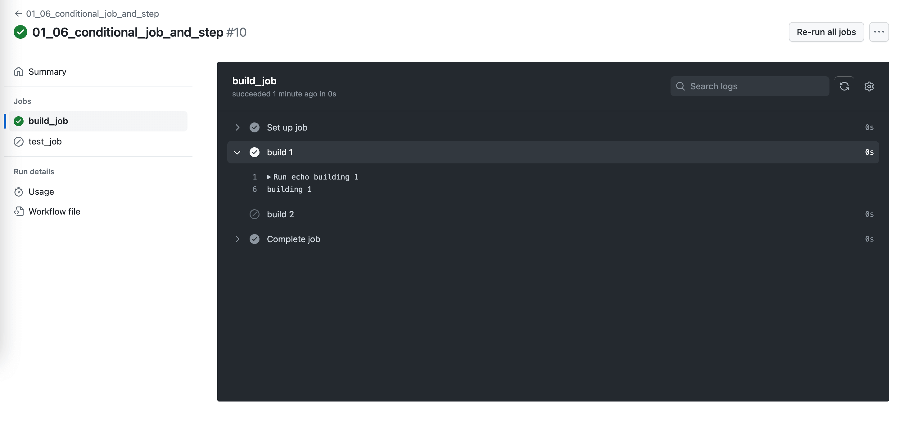

Conditional Job and Step
==============================================================================

Sample Workflow Definition
------------------------------------------------------------------------------
.. literalinclude:: ../../../../.github/workflows/01_06_conditional_job_and_step.yml
   :language: yaml
   :linenos:

Sample Workflow Run
------------------------------------------------------------------------------

Reference
------------------------------------------------------------------------------
- job.<job_id>.if: https://docs.github.com/en/actions/using-workflows/workflow-syntax-for-github-actions#jobsjob_idif
- jobs.<job_id>.steps[*].if: https://docs.github.com/en/actions/using-workflows/workflow-syntax-for-github-actions#jobsjob_idstepsif
- Logical operators: https://docs.github.com/en/actions/learn-github-actions/expressions#operators
- Functions: https://docs.github.com/en/actions/learn-github-actions/expressions#functions
- Context Availability: https://docs.github.com/en/actions/learn-github-actions/contexts#context-availability
