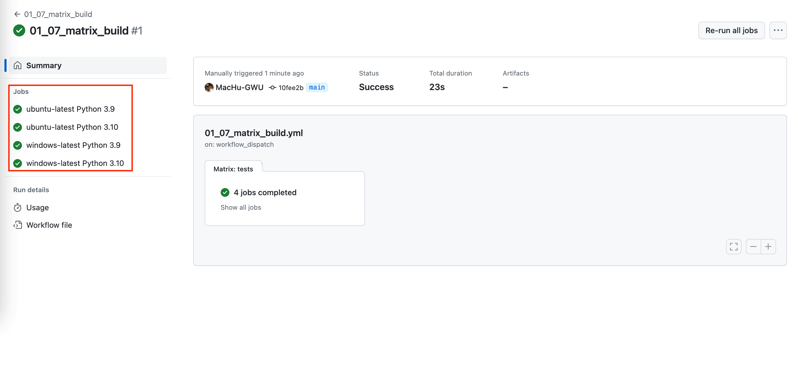

Matrix Build
==============================================================================
这是在你进行并行执行时候传递参数用的. 例如你的 Job 有两个参数 OS, 和 Python version. 而你需要同时在 2 个 OS (windows / linux), 以及 3 个 Python version (3.8, 3.9, 3.10) 上运行. 这时就可以用 Matrix build 来实现对 Job 并行执行.

Sample Workflow Definition
------------------------------------------------------------------------------
.. literalinclude:: ../../../../.github/workflows/01_07_matrix_build.yml
   :language: yaml
   :linenos:

Sample Workflow Run
------------------------------------------------------------------------------

