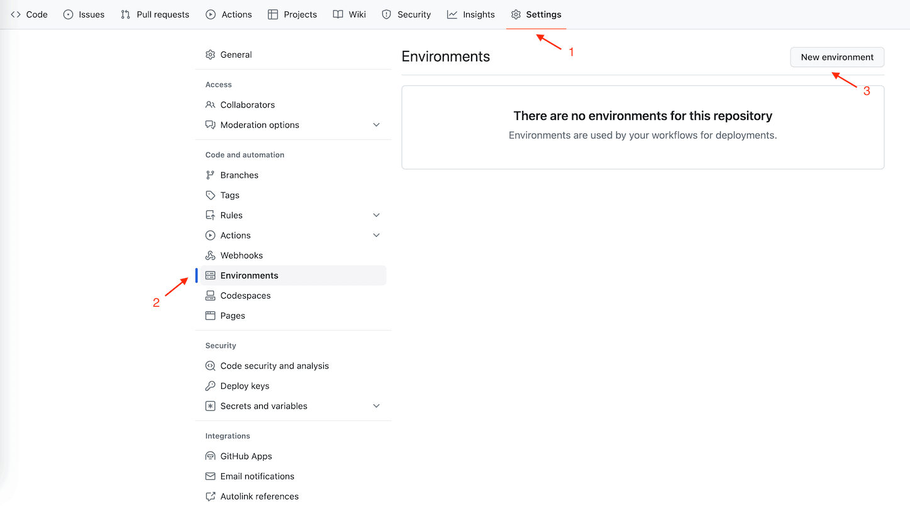
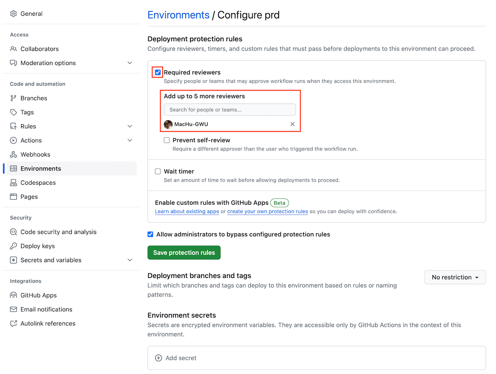

Manual Approve
==============================================================================
在生产项目管理的过程中, 在 release 到 production 之前需要手动审批是非常常见的流程. GitHub Action 的做法是在 settings 中定义 Environment, 例如 ``prd`` 然后给这个 Environment 定义 Deployment protection rules, 要求指定的人员 approve 了之后才能运行某个 Job. 里面还有一些高阶选项例如, 如果这个管理员本人 push 代码, 是否要求必须其他人来 approve. 还有例如管理员是否可以无视这一规则强行 approve.

接着在 workflow yaml 中的 ``jobs.<job_id>.environment`` 将这个 job 标记为 ``prd`` 即可.

这里有个小坑, 这个 ``jobs.<job_id>.environment.name`` 不接受 ``${{ env.ENV_NAME }}`` 这个 context. 如果你想要将这个值参数化, 那你需要在 ``on.workflow_dispatch.inputs`` 或者 ``on.workflow_call.inputs`` 中定义变量, 然后把这个变量 pass 给 ``jobs.<job_id>.environment.name`` 从而实现参数化.

Sample Workflow Definition
------------------------------------------------------------------------------
.. literalinclude:: ../../../../.github/workflows/01_09_04_reusable_workflow_caller.yml
   :language: yaml
   :linenos:

Reference
------------------------------------------------------------------------------
- `Manual Approve <https://docs.github.com/en/actions/managing-workflow-runs/reviewing-deployments>`_
