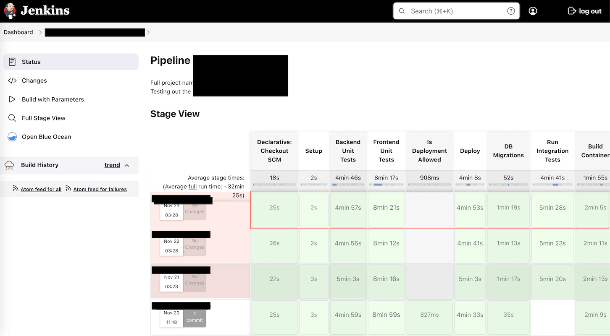
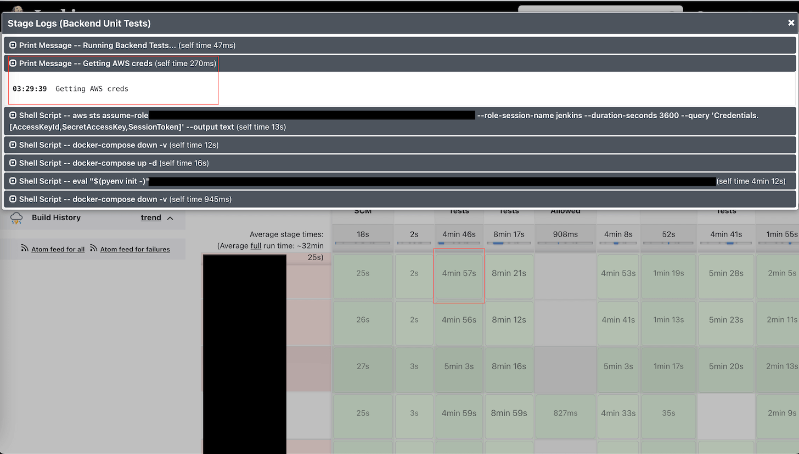

GitHub Action UI
==============================================================================

What are we looking for
------------------------------------------------------------------------------
一个 CI 系统的 UI 设计的好不好会很大程度上影响开发体验和使用效率. 在讨论 GitHub Action UI 之前, 我们先来讨论一下作为开发者, 我们需要一个怎样的 UI.

首先, 我们先用业内流行度最高的开源软件 Jenkins 为例.

我个人很喜欢老牌开源 CI 系统 Jenkins 的 CI Build Job Run 的 UI 设计. 它能将一个 Job Run 中的许多 Stage 分成小窗口, 点开小窗口就能看到里面每个 Step 的命令的输入输出. 并且能将多个 Job Run 的按照时间顺序排列在一起. 下面是 Jenkins UI 的截图:

我个人曾经是 AWS CodeBuild 的重度用户. 不过 CodeBuild 里用户无法自定义 Stage, 只能用 CodeBuild 里定义的 install, pre-build, build, post-build 几个 Phase. 而由于 CodeBuild 的日志都是用 CloudWatch 捕获的, 所以它的日志截图就是一长串的纯文本, 不像 Jenkins UI 的日志界面可以一层层折叠打开.

我们回到 GitHub Action