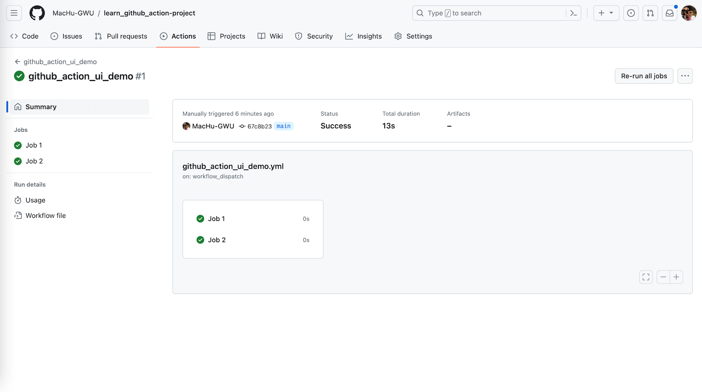
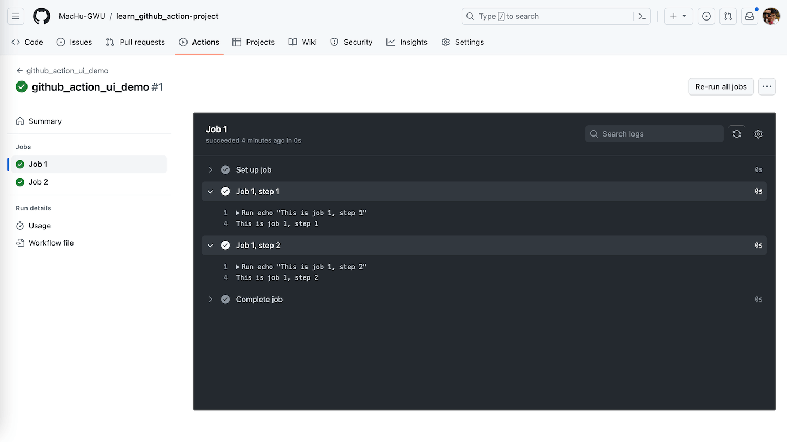
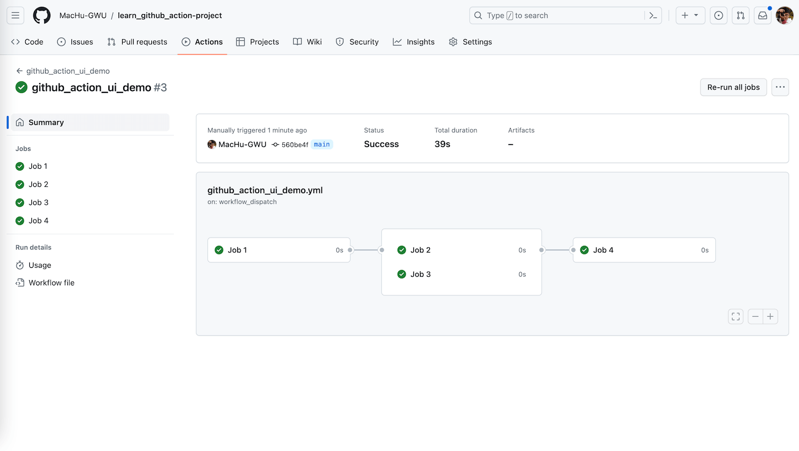
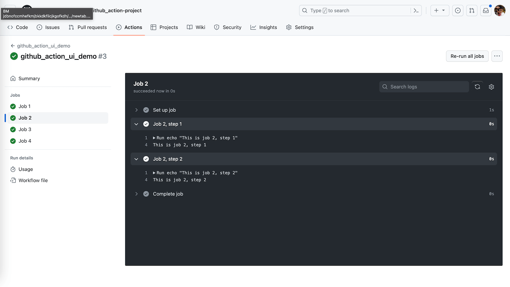

GitHub Action UI
==============================================================================

What are we looking for
------------------------------------------------------------------------------
一个 CI 系统的 UI 设计的好不好会很大程度上影响开发体验和使用效率. 在讨论 GitHub Action UI 之前, 我们先来讨论一下作为开发者, 我们需要一个怎样的 UI.

首先, 我们先用业内流行度最高的开源软件 Jenkins 为例.

我个人很喜欢老牌开源 CI 系统 Jenkins 的 CI Build Job Run 的 UI 设计. 它能将一个 Job Run 中的许多 Stage 分成小窗口, 点开小窗口就能看到里面每个 Step 的命令的输入输出. 并且能将多个 Job Run 的按照时间顺序排列在一起. 下面是 Jenkins UI 的截图:

.. image:: ./jenkins-ui-1.png
.. image:: ./jenkins-ui-2.png

我个人曾经是 AWS CodeBuild 的重度用户. 不过 CodeBuild 里用户无法自定义 Stage, 只能用 CodeBuild 里定义的 install, pre-build, build, post-build 几个 Phase. 而由于 CodeBuild 的日志都是用 CloudWatch 捕获的, 所以它的日志截图就是一长串的纯文本, 不像 Jenkins UI 的日志界面可以一层层折叠打开.

所以我认为一个好的 CI 系统的 UI 应该有以下几个特点:

1. 能把 Job Orchestration 用 DAG 的形式直观的显示出来, 展现它们的依赖关系.
2. UI 能把每一个 Job 下的 Stage 按照流水线折叠或者打开, 显示每一步的成功或失败情况.
3. UI 能把每一个 Stage 下的 Step 按照流水线折叠或者打开, 显示每一步的命令的输入输出.

下面我们带着这一个结论来看看 GitHub Action 的 UI 设计.

GitHub Action UI Demo
------------------------------------------------------------------------------
这里我们做了一个 GitHub Action UI 的测试, 看看 GitHub Action 的 UI 是如何展示 Build 的日志的. 下面给出了测试的截图:

可以看出 GitHub Action 可以被依赖关系定义的 Orchestration 对象是 Job, 每个 Job 下面分很多 Step, 一个 Step 里可以有很多 Command. GitHub Action 会用类似 Airflow DAG 的那种有向无环图来展示 Orchestration 的拓扑图. 而点开每个 Job 会看到按照流水线进行的很多 Step. 每个 Step 展开后可以看到每个 Command 的输入和输出. 我个人觉得这个 UI 设计还是很不错的.

- `github_action_ui_demo.yml <../../.github/workflows/github_action_ui_demo.yml>`_: GitHub Action Workflow 的源码.
- `CI job run examples <https://github.com/MacHu-GWU/learn_github_action-project/actions/workflows/github_action_ui_demo.yml>`_: 一些我 Run 的 GitHub Action Job 的例子.

一些私货
------------------------------------------------------------------------------
`Python Rich <https://pypi.org/project/rich/>`_ 是一个可以在 Terminal 中输出漂亮的界面的库. 很多 CI 系统的日志只能显示出文本, 并不能显示格式和颜色. 但是 GitHub action 可以!
